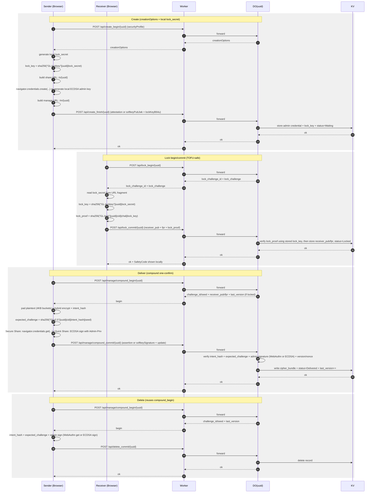

> **Language**: English | [中文](./PRD.zh.md)

# ZeroLink Product Requirements Document (PRD) v3.0

**Security-First / Low-Friction / DO-Atomic / WebAuthn Admin / TOFU-Safe / Padded Ciphertext**

> **v3.0 Change Summary (relative to v2.5)**: Unified the three security tiers (Standard / Strict / Hardware-Only) into two user-facing entry points: **Quick Share** (password mode) and **Secure Share** (Passkey mode). Removed Hardware-Only attestation enforcement (poor technical feasibility; retained legacy backward-compatible reads). Legacy tiers (standard / strict / hardware_only) are used only for backward-compatible display of existing channels and are no longer offered as options for new channels.

---

## 1. Product Overview

ZeroLink is a zero-knowledge secret sharing tool: no accounts, and the server never holds plaintext or private keys. Content is end-to-end encrypted, and only the receiver's local private key can decrypt it. The sender holds administrative authority and can update/destroy ciphertext but cannot decrypt the content.

v3.0 product goals:

**Without sacrificing the "minimal-friction user experience," reduce real-world high-probability attack surfaces (preload lock-sniping, passkey synchronization, ciphertext length side-channel, malicious JS delivery) to an acceptable and even auditable level.**

---

## 2. Security Objectives and Threat Model

### 2.1 Security Objectives (Mandatory)

1. **Server Zero-Knowledge**: The server/KV/DO never stores plaintext or any private key
2. **End-to-End Confidentiality**: Plaintext only appears locally on the receiver's device
3. **Unforgeable Update/Destroy**: Only the admin can authorize writes/destruction
4. **Replay/Reorder/Concurrent-Overwrite Resistance**: Monotonic version + nonce deduplication + DO serialization
5. **Minimal Metadata Leakage**: Public endpoints cannot infer state; receiver_pub is not exposed to unauthorized parties
6. **Frontend Integrity Verification**: CSP/Signed Manifest/zero third-party scripts/reproducible builds
7. **Non-Exportable Admin Private Key**: WebAuthn private key resides in the system/hardware
8. **Controllable TOFU Lock-Sniping Risk**: Preload crawlers cannot lock before the real receiver
9. **Significantly Reduced Ciphertext Length Leakage**: Default padding to fixed block boundaries

### 2.2 Explicit Boundaries (Must Be Documented)

- Client compromised by a malicious extension/trojan: may still abuse a single operation within the user confirmation window; cannot silently export the admin private key for long-term control
- The Web scenario cannot fundamentally solve the ultimate trust problem of "malicious server delivering JS": v2.5 provides **self-hosting/offline packages/verifiable release chain** as optional "ceiling solutions"

---

## 3. Key Changes Overview (Relative to v2.4)

### 3.1 New: Lock Secret (URL Fragment) Anti-Lock-Sniping

- At creation, a lock_secret (32 random bytes) is generated and **placed only in the share link's URL fragment** (e.g., /s/UUID#k=...)
- **The fragment is never sent with HTTP requests**, so preload bots that access /s/UUID cannot obtain the lock_secret and therefore cannot lock
- Locking requires the lock_secret to participate in a challenge-response (Lock Challenge)

### 3.2 New: Padding (Block Alignment) to Reduce Ciphertext Length Leakage

- Plaintext is uniformly padded to multiples of 4KB/8KB (default 4KB) before encryption
- Padding structure includes: original text length + random fill
- cipher_bundle remains AES-GCM ciphertext, but lengths become discrete buckets

### 3.3 Tightened: Receiver KDF Enforces Argon2id

- Default and mandatory: Argon2id (parameter target latency 250-500ms)
- PBKDF2 is only allowed in "compatibility mode" and is clearly labeled "reduced security" in the UI

### 3.4 Two User-Facing Tiers (v3.0 Simplification)

Two tiers available at creation (legacy tiers are only used for backward compatibility with existing channels):
- **Quick Share**: Password mode, locally generated ECDSA admin key (Argon2id-wrapped), no passkey required, 4KB padding
- **Secure Share**: Passkey mode, UV=required / RK=discouraged, 8KB padding, merges the security levels of the original Standard+Strict
- **Legacy (read-only)**: standard / strict / hardware_only only render existing channels; not offered as new creation options

### 3.5 New: Self-Hosting / Verifiable Releases

- Official Cloudflare version remains the default
- Docker Compose one-click self-hosting (protocol-equivalent implementation of Worker/DO/KV self-hosting: HTTP service + Postgres/SQLite + Redis/transaction locks; or protocol-equivalent implementation if Cloudflare-compatible runtime is impractical)
- Release chain: Signed Manifest + reproducible builds + optional offline static packages (users can open locally/deploy on their own domain)

---

## 4. Product Modes and Security Tiers (Externally Clear)

Selectable `securityProfile` at creation (v3.0 two tiers):

### 1. Quick Share

- **Admin Authority**: Locally generated ECDSA P-256 keypair, wrapped by user password via Argon2id and encoded in the admin link's URL fragment (not stored in IndexedDB)
- **WebAuthn**: Not required
- **Receiver**: Argon2id enforced
- **Padding**: 4KB blocks
- **adminMode**: `password` (internal protocol field)
- **Suitable for**: Cross-device/cross-browser usage, environments without passkey support, or users who prefer password managers

### 2. Secure Share

- **Admin Authority**: WebAuthn passkey (device or platform), UV=required, RK=discouraged
- **WebAuthn**: Required, cannot be downgraded
- **Receiver**: Argon2id enforced
- **Padding**: 8KB blocks (higher privacy)
- **adminMode**: `webauthn` (internal protocol field)
- **Suitable for**: Highest security requirements, environments where passkey is available

### Legacy Tiers (Read-Only, Backward Compatible)

Existing channels may store `standard` / `strict` / `hardware_only` security_profile; the system continues to render and operate on them correctly. These options are not available for new channel creation.

- **standard**: Equivalent to Quick Share security level (UV preferred)
- **strict**: Equivalent to Secure Share security level (UV required), retained for backward compatibility
- **hardware_only**: Originally enforced cross-platform; attestation=direct enforcement removed (technical reasons); current behavior is identical to strict

---

## 5. User Flows (v2.5 UX Edition)

### 5.1 Create (Sender)

1. Choose mode: **Quick Share** (Password) or **Secure Share** (Passkey)
2. **Quick Share flow**: Enter password -> locally generate ECDSA keypair -> Argon2id wrapping -> Create Finish (adminMode=password)
3. **Secure Share flow**: Create Begin -> WebAuthn registration (UV=required, RK=discouraged) -> Create Finish
4. The page displays two links:
   - Share link (receiver): /s/:uuid#k=\<lock_secret_b64url\>[&af=\<sender_auth_fpr\>]
   - Admin link (sender): /m/:uuid#wk=\<wrapped_priv\> (Quick Share) or /m/:uuid (Secure Share)

> **Mandatory UI notice**: The share link must be copied in full (including the part after #), otherwise the receiver cannot lock

### 5.2 Receiver Locking (Receiver: Foolproof)

- After opening the share link, the page shows a minimal animation (3 frames):
    1. "Your password stays only with you"
    2. "It generates your decryption key (the sender doesn't know it either)"
    3. "After locking, only you can open the content"
- Enter password -> generate RSA keypair -> Argon2id-wrap private key and store locally
- Lock request must carry a lock challenge response (see protocol)
- After successful locking, display **Safety Code**:
    - Emoji sequence (e.g., 6-10 emoji)
    - Color blocks (e.g., 4x4/5x5 color grid)
    - "Advanced" section expands to show raw hex fingerprint

### 5.3 Sender Delivery (Sender: Soft Verification)

- The admin page shows the same Safety Code (emoji/color blocks), with copy:
    - "Please quickly verify that the safety code matches what the other party sent you (recommended via phone call/another messaging tool)"
- The default UI does not display terms like "fingerprint/hash/public key"; these appear only in advanced mode
- Click deliver: goes through compound_begin/commit, completing the write with a single system confirmation

### 5.4 WebAuthn Unavailable (Degraded UX)

When navigator.credentials is unavailable or the call fails:

- The page automatically detects WebAuthn support status
- **Quick Share**: Always available (does not depend on WebAuthn); auto-selected when WebAuthn is unavailable
- **Secure Share**: Displays "This environment does not support Passkey" warning; button is grayed out and unclickable
- UI shows prompt: "Secure Share requires WebAuthn support. Please switch browsers/devices, or use Quick Share"

---

## 6. Key Security Solutions in v2.5

### 6.1 TOFU Lock-Sniping (Preload Crawler Locks First)

**v2.5 Hard Fix: Lock Secret + Lock Challenge**

- Even if an attacker/crawler accesses /s/:uuid first, it cannot lock because it does not have the lock_secret from the fragment
- During locking, the DO issues a one-time challenge; the receiver must provide lock_proof = SHA256("GL-lock"||uuid||lock_challenge_id||lock_challenge||lock_key)
- The DO verifies lock_proof before accepting receiver_pub

The UX layer still recommends:

- Safety code verification via an out-of-band channel (phone call/another IM), but this is no longer the sole line of defense

### 6.2 Ciphertext Length Leakage

**v2.5 Default Padding**: Plaintext is padded to fixed block multiples before encryption, reducing length inference precision.

### 6.3 Passkey Synchronization Boundaries (v3.0 Simplification)

- **Quick Share**: Does not use WebAuthn; no passkey synchronization issue
- **Secure Share**: Uses WebAuthn (UV=required, RK=discouraged); allows platform passkey synchronization; if the browser provides backupState/backupEligibility, it can be detected and flagged, but not forcibly rejected

### 6.4 Malicious Server JS Delivery

v2.5 provides three layers of response:

1. **Verifiable release chain (Signed Manifest + reproducible builds)**: Increases the probability that "tampering can be detected"
2. **Offline package/local opening** (planned, not yet implemented): Users can optionally download an offline static package from the release page (reducing online delivery risk)
3. **Self-hosting** (planned, not yet implemented): Provides Docker Compose protocol-equivalent implementation, completely handing the trust root to the user

---

## 7. Cryptography and Data Formats (v2.5)

### 7.1 Content Encryption (Unchanged + Padding)

- AES-256-GCM encrypts the body (ciphertext bundle remains cipher_bundle)
- RSA-OAEP-256 wraps the AES key (enc_content_key)

#### Padding Scheme (Mandatory, Enabled by Default)

padded_plaintext format definition:

- len: uint32 (original text length, big-endian)
- data: original text bytes
- pad: random bytes, padded to ceil((4 + len)/PAD_BLOCK)*PAD_BLOCK
- Default PAD_BLOCK = 4096 (configurable to 8192)

The final encryption target is padded_plaintext; the receiver truncates to the original text by len after decryption.

> For very large content (e.g., >1MB), padding may be disabled or a larger block (e.g., 64KB) may be used, but the default remains enabled.

### 7.2 Receiver Private Key Wrapping (Argon2id Enforced)

- Argon2id parameters use a target latency strategy (250-500ms)
- Parameters are written to the local header: salt, m, t, p, version
- PBKDF2 is only allowed in "compatibility mode"

### 7.3 Safety Code (Softened Fingerprint Verification)

Computed from receiver_pub_fpr = SHA256(SPKI(receiver_pub)):

- Emoji Safety Code: Hash segments mapped to an emoji table (fixed table, stable output)
- Color Blocks: Hash nibbles mapped to a fixed color palette
Display rules:

- Default: Emoji or Color (switchable)
- Advanced: Short fingerprint (first 6/last 6) + full hex (collapsed)

---

## 8. State Machine (Similar to v2.4, with Lock Challenge Added)

States and transitions remain as in v2.4, but locking requires the lock_begin/lock_commit challenge flow (see API).

**State Set**: Waiting, Locked, Delivered, Deleted, Expired

**Allowed Transitions**:
- Waiting -> Locked (lock_commit succeeds)
- Locked -> Delivered (compound_commit update)
- Delivered -> Delivered (compound_commit update)
- Waiting|Locked|Delivered -> Deleted (delete_commit)
- Waiting|Locked|Delivered -> Expired (expire)

**Prohibited Transitions**:
- Repeated lock_commit in non-Waiting state
- Any write operation after Deleted/Expired
- lock_commit without a prior lock_begin (challenge must match and is single-use)

---

## 9. Quick Share (Password Mode) Protocol Definition

Quick Share is the official user entry point in v3.0, replacing "Compatibility Mode" rather than being a fallback option:

- **Admin Authority**: Locally generated ECDSA P-256 private key (Admin-Priv), wrapped via user password Argon2id and encoded in the manage link's URL fragment (not stored in IndexedDB)
- **Update/Delete Authorization**: ECDSA signature payload mode (DO still handles version/nonce atomicity)
- **Protocol Field**: `adminMode: "password"` (internal); legacy channels may store `"softkey"` (treated as equivalent for backward compatibility)
- **Padding**: 4KB blocks (compared to Secure Share's 8KB, lower bandwidth but slightly less privacy)
- **UI**: Not labeled as "lower security"; presented as an independent, valid sharing mode

> Note: Quick Share security depends on user password strength. The UI guides users to choose sufficiently strong passwords through a password strength indicator.

---

## 10. API (v3.0 Current)

General requirements:

- All responses: `Cache-Control: no-store`
- `/api/public/:uuid` returns a public state snapshot, not just `exists`
- All sensitive write operations go through DO serialization
- Error responses have a constant shape: `{ok:false, code}`

### 10.1 GET /api/public/:uuid

Response:
```json
{
  "ok": true,
  "state": "waiting|locked|delivered",
  "adminMode": "webauthn|password|softkey",
  "securityProfile": "quick|secure|standard|strict|hardware_only",
  "receiverPubFpr": "hex..."
}
```

Notes:

- `receiverPubFpr` is only returned after the receiver has locked
- After a channel is physically deleted or expired, public reads return `404 NOT_FOUND`
- In mixed-version rollback/local mock scenarios, legacy `deleted` / `expired` public states may still appear; the frontend should uniformly normalize these to unavailable

### 10.2 Create (Quick Share / Secure Share)

#### POST /api/create_begin/:uuid

Request:
```json
{
  "uuid": "string(21)",
  "timestamp": 1730000000000,
  "securityProfile": "quick|secure|standard|strict|hardware_only"
}
```

Response:
```json
{
  "ok": true,
  "creationOptions": { "...": "..." }
}
```

Server behavior:

- Creates a `waiting` channel record and persists the `securityProfile`
- Issues a WebAuthn registration challenge for Secure Share (encapsulated in `creationOptions`)
- Quick Share still uses the same `create_begin`/`create_finish` protocol, but the frontend does not use the returned WebAuthn `creationOptions`
- `lock_secret` is generated locally by the frontend and appended to the share link fragment; the server only persists `lockKeyB64u` after `create_finish`

#### POST /api/create_finish/:uuid

WebAuthn admin mode:
```json
{
  "adminMode": "webauthn",
  "uuid": "string(21)",
  "attestation": { "...": "..." },
  "lockKeyB64u": "base64url(sha256('GL-lockkey'||uuid||lock_secret))",
  "timestamp": 1730000000000
}
```

Quick Share / legacy password mode:
```json
{
  "adminMode": "password",
  "uuid": "string(21)",
  "softkeyPubJwk": { "...": "..." },
  "lockKeyB64u": "base64url(sha256('GL-lockkey'||uuid||lock_secret))",
  "timestamp": 1730000000000
}
```

Notes:

- Legacy `softkey` is protocol-equivalent to `password`; retained only for backward compatibility
- The server saves admin credentials, `securityProfile`, and `lockKeyB64u`
- `lockKeyB64u` is used to verify `lock_proof` subsequently; the server never persists `lock_secret`

### 10.3 Locking (Split into lock_begin / lock_commit)

#### POST /api/lock_begin/:uuid

Purpose: Prevent lock_proof replay and let the DO control single-use consumption.

Response:
```json
{
  "ok": true,
  "uuid": "string",
  "lock_challenge_id": "base64url",
  "lock_challenge": "base64url(32)",
  "expires_at": 1730000000000
}
```

The DO stores the challenge (TTL 60s, single-use).

#### POST /api/lock_commit/:uuid

Request (receiver carries receiver_pub + lock_proof):

```json
{
  "uuid": "string(21)",
  "lock_challenge_id": "base64url",
  "lock_proof": "hex(sha256(...))",
  "receiver_pub_jwk": { "...": "..." },
  "receiver_pub_fpr": "hex...",
  "locked_at": 1730000000000
}
```

Where:

- lock_proof = SHA256("GL-lock" || uuid || lock_challenge_id || lock_challenge || lock_key)
- lock_key is derived by the frontend from lock_secret (lock_secret is not uploaded)

DO verification:

- lock_challenge has not expired and has not been consumed
- lock_key and lock_proof correspond correctly (DO verifies using the stored lock_key)

Final result: writes receiver_pub, fpr, status=Locked

### 10.4 Delivery (compound_begin/commit, v3.0 Retains Single Confirmation)

Same as v2.4, but the update payload adds:

- pad_block (default 4096)

> Note: `plaintext_len` is not an API-level field. It exists only inside the encrypted padding header (the first 4 bytes of `padded_plaintext`; see Appendix E). It is never transmitted as a top-level request field.

### 10.5 Delete (compound_begin + delete_commit)

Delete reuses `compound_begin` for challenge issuance, then calls `delete_commit` with admin authorization. There is no separate `delete_begin` endpoint.

### 10.6 Quick Share / Legacy Password API

New fields:

- adminMode="webauthn"|"password"|"softkey"
- Under password / softkey, update/delete requires sig (ECDSA signature; softkey is legacy backward-compatible only)

---

## 11. WebAuthn Verification (v3.0, Inheriting v2.4 Byte-Level Specification)

- origin, rpIdHash, UV/UP, challenge exact matching, COSE ES256 signature verification
- Secure Share / strict / hardware_only:
    - userVerification="required"
    - residentKey="discouraged"
    - attestation="none"

---

## 12. Frontend Integrity and "Verifiable Release Chain" (Ceiling Solution for Malicious JS Delivery)

### 12.1 Signed Manifest (Recommended)

- At release, generate manifest.json containing:
    - Version number
    - SHA-256 of each static resource
    - Build time, commit hash
- Sign the manifest with the project's **offline signing private key (Ed25519)**, publishing manifest.sig
- The app displays the manifest hash at runtime (advanced users can verify)

> Note: This cannot prevent an attacker from directly tampering with index.html to disable verification, but it makes "offline download package + verification tool" viable.

### 12.2 Offline Package (Paranoid Mode) (Planned, Not Yet Implemented)

- Provide a separately downloadable offline.zip (static files)
- Users can open locally or self-host on their domain (even file://, but WebAuthn and certain APIs may be restricted; domain hosting is recommended)

### 12.3 Self-Hosting (Planned, Not Yet Implemented)

- Provide Docker Compose:
    - Frontend static files
    - API service (protocol-equivalent implementation: challenge/nonce/version/lockkey/padding/WebAuthn verification)
    - DB (Postgres/MySQL) or SQLite + transaction locks
- The self-hosted version must pass the same protocol test vectors (canonical, challenge, nonce)

---

## 13. UI/UX Specification (Implementing Product Manager Recommendations)

### 13.1 Softened Fingerprint Verification Presentation

- Default: Emoji Safety Code (e.g., 8 emoji)
- Secondary: Color Blocks (e.g., 4x4)
- Advanced: Short fingerprint + full hex (collapsed)

Copy principles:

- Do not use terms like "fingerprint/hash/public key" (except in advanced mode)
- Strongly suggest "out-of-band verification" but without creating anxiety (use gentle prompts)

### 13.2 Receiver Foolproof Animation and Copy

- Animation within 3 frames + 1 strong prompt:
    - "This is your decryption key - the sender doesn't know it either"
- Password strength prompt (but not forcing overly strong passwords to avoid discouraging users; Secure Share is available separately as a higher security option)

### 13.3 Guidance When WebAuthn Is Unavailable

- On failure, provide a clear reason classification (without leaking sensitive information):
    - "Browser not supported"
    - "Current page is insecure (not https / not same-origin)"
    - "System has not enabled biometrics/security key"
- Quick Share: Remains available, with explanation that this is password mode
- Secure Share: Blocked, with suggestion to "switch devices/browsers"

---

## 14. Test Vectors and Acceptance (v3.0)

New tests required:

1. **TOFU Lock-Sniping**: Access without the fragment cannot complete lock_commit (lock_proof verification fails)
2. **lock_challenge Replay**: Reusing the same challenge_id for lock_commit must fail
3. **Padding**: Different plaintext lengths map to the same bucket-length ciphertext (at least 4KB buckets)
4. **Argon2id Enforcement**: Receiver private key wrapping must use Argon2id; Quick Share admin key must also use Argon2id wrapping
5. **Secure Share Policy**: secure/strict/hardware_only must require UV=required and use non-discoverable credentials for registration (`residentKey="discouraged"`)

---

## 15. Protocol Diagram (Mermaid)



---

## Appendix A: Parameter Table and Constants (Mandatory)

- UUID_LENGTH = 21 (nanoid)
- TIMESTAMP_SKEW_MS = 120000 (+/-120s)
- NONCE_BYTES = 24 (base64url)
- NONCE_TTL_MS = 600000 (10min)
- CHALLENGE_BYTES = 32
- CHALLENGE_TTL_MS = 60000 (60s)
- LOCK_SECRET_BYTES = 32 (base64url, stored in URL fragment)
- LOCK_KEY_BYTES = 32 (server storage, sha256 output)
- PAD_BLOCK_DEFAULT = 4096 (configurable to 8192)
- PAD_BLOCK_MAX = 65536 (upper limit)
- MAX_PLAINTEXT_BYTES = 2MB (recommended; adjustable per product positioning)
- WebAuthn: default alg = -7 (ES256), UV required (Strict/HardwareOnly)

---

## Appendix B: Canonical (Ghost Canon v1) Specification and Test Vectors (Mandatory)

### B1. Rules

- Object keys sorted recursively by Unicode code point in ascending order
- Arrays preserve order
- Numbers must be integers, decimal, no scientific notation
- Output minified JSON, no whitespace
- UTF-8 bytes

### B2. Test Vectors (update / delete)

#### B2.1 update (without sig)

Input object (conceptual):

```json
{
  "op": "update",
  "uuid": "u",
  "version": 1,
  "timestamp": 1730000000000,
  "nonce": "n",
  "receiver_pub_fpr": "f",
  "cipher_bundle": {
    "ciphertext": "ct",
    "iv": "iv",
    "aad": "aad",
    "enc_content_key": "ek",
    "ciphertext_hash": "h"
  },
  "expire_at": null,
  "pad_block": 4096
}
```

Canonical output must be:

```json
{"cipher_bundle":{"aad":"aad","ciphertext":"ct","ciphertext_hash":"h","enc_content_key":"ek","iv":"iv"},"expire_at":null,"nonce":"n","op":"update","pad_block":4096,"receiver_pub_fpr":"f","timestamp":1730000000000,"uuid":"u","version":1}
```

#### B2.2 delete

Input object (conceptual):

```json
{
  "op": "delete",
  "uuid": "u",
  "version": 2,
  "timestamp": 1730000000000,
  "nonce": "n"
}
```

Canonical output must be:

```json
{"nonce":"n","op":"delete","timestamp":1730000000000,"uuid":"u","version":2}
```

---

## Appendix C: TOFU Lock-Sniping Fix (Lock Secret / Lock Key / Lock Proof) Precise Definition

### C1. Generation and Storage at Create Time (Critical)

- Frontend locally generates lock_secret: 32 random bytes, written to the share link fragment:
    ```
    share_url = /s/<uuid>#k=<b64url(lock_secret)>
    ```
- Frontend computes lock_key:
    ```
    lock_key = SHA256( UTF8("GL-lockkey") || UTF8(uuid) || lock_secret )
    ```
- Frontend sends lock_key_b64u back in create_finish
- Server stores lock_key (base64url or hex; must be consistent; base64url recommended)

> Note: lock_secret must never be logged or stored in KV as plaintext.

### C2. Lock Two-Phase Flow

1. lock_begin: DO issues {lock_challenge_id, lock_challenge} (32 random bytes, TTL 60s, single-use)
2. lock_commit: Client submits receiver_pub + fpr + lock_proof

### C3. lock_proof Computation (Client-Side)

- Client reads lock_secret from the fragment, locally computes lock_key (same as C1)
- Then computes:
    ```
    lock_proof = SHA256( UTF8("GL-lock") || UTF8(uuid) || b64url_decode(lock_challenge_id) || b64url_decode(lock_challenge) || lock_key )
    ```
- lock_commit only submits lock_proof (hex or base64url; lowercase hex recommended)

### C4. DO Verification (Server-Side)

- Retrieves lock_key from KV
- Recomputes expected lock_proof using the same concatenation
- Only allows receiver_pub to be written if the values match

### C5. Security Properties

- Preload crawlers do not have the fragment -> cannot obtain lock_secret -> cannot obtain lock_key -> cannot forge lock_proof
- Even if lock_proof is obtained, it can only be used with the single-use lock_challenge; replay fails (challenge consumed)

---

## Appendix D: Lock API Schema (v2.5)

### D1. POST /api/lock_begin/:uuid

Response:

```json
{
  "ok": true,
  "uuid": "string(21)",
  "lock_challenge_id": "base64url(16-32)",
  "lock_challenge": "base64url(32)",
  "expires_at": 1730000000000
}
```

### D2. POST /api/lock_commit/:uuid

Request:

```json
{
  "uuid": "string(21)",
  "lock_challenge_id": "base64url",
  "lock_proof": "hex(lowercase)",
  "receiver_pub_jwk": {
    "kty": "RSA",
    "alg": "RSA-OAEP-256",
    "n": "...",
    "e": "...",
    "ext": true,
    "key_ops": ["encrypt"]
  },
  "receiver_pub_fpr": "hex(lowercase)",
  "locked_at": 1730000000000
}
```

Response:

```json
{
  "ok": true
}
```

Error semantics (coarse-grained):

- 401: Challenge expired/does not exist
- 403: lock_proof mismatch / no longer in Waiting state
- 409: Challenge already consumed (replay)

---

## Appendix E: Padding Specification (Precise Byte Format + Notes)

### E1. padded_plaintext Format (bytes)

- orig_len: uint32 big-endian (4 bytes)
- orig_data: orig_len bytes
- pad_rand: random bytes, length such that total length is a multiple of PAD_BLOCK
- Total length: ceil((4+orig_len)/PAD_BLOCK) * PAD_BLOCK

### E2. Generation Rules (Client-Side)

- PAD_BLOCK defaults to 4096; can be included in the update payload as pad_block (for audit consistency; not recommended for public display)
- pad_rand must be cryptographically secure random numbers
- If orig_len approaches the upper limit, reject or prompt for "file mode/chunk mode" (if supported in the future) per MAX_PLAINTEXT_BYTES

### E3. Decoding Rules (Receiver)

- Decrypt to obtain padded_plaintext
- Read the first 4 bytes to get orig_len
- Extract the subsequent orig_len bytes as the plaintext
- Ignore the remaining pad_rand

### E4. Relationship with AES-GCM

- AES-GCM is still used; padding does not introduce a padding oracle
- AAD continues to bind uuid/version/fpr, preventing substitution and context confusion

---

## Appendix F: Cipher Bundle Structure and Length Leakage Bucket Strategy

CipherBundle (base64url):

- enc_content_key (RSA-OAEP output, fixed length ~256 bytes)
- ciphertext (length ~= padded_plaintext_len + GCM tag)
- iv (12 bytes)
- aad (recommended: base64url AAD bytes)
- ciphertext_hash (SHA-256 hex)

Bucket strategy:

- Default PAD_BLOCK=4096, leakage granularity is 4KB buckets
- Higher security tiers can increase to 8KB/16KB (more private but more bandwidth-intensive)

---

## Appendix G: WebAuthn Policy (v3.0) Specification

### G1. Quick Share (quick)

- Does not use WebAuthn; fully password mode
- adminMode = "password"

### G2. Secure Share (secure)

- userVerification = "required" (mandatory)
- residentKey = "discouraged" (uses non-discoverable credential)
- attestation = "none"
- Suitable for platform passkeys and hardware security keys

### G3. Legacy Tiers (Backward Compatible)

#### standard (equivalent to early Quick Share security level)
- userVerification = "preferred"
- residentKey = "discouraged"
- attestation = "none"

#### strict (equivalent to Secure Share)
- userVerification = "required"
- residentKey = "discouraged"
- attestation = "none"

#### hardware_only (equivalent to Secure Share; attestation enforcement removed)
- userVerification = "required"
- residentKey = "discouraged"
- attestation = "none" (original "direct" enforcement removed; cross-platform restriction removed)
- Removal reason: x5c attestation verification is complex to implement, and its practical significance is limited in the modern passkey ecosystem

---

## Appendix H: WebAuthn Verification Byte-Level Steps (Continuing v2.4, with Supplementary Constraints for Lock/Profile)

Commit (compound/delete) verification order must include:

1. Verify credentialId == stored cred_id
2. clientDataJSON:
    - type=="webauthn.get"
    - origin strict match
    - challenge strict match expected_challenge
3. authenticatorData:
    - rpIdHash == SHA256(rpId)
    - flags: UP=1; UV per policy
4. Signature verification:
    - signedData = authenticatorData || SHA256(clientDataJSON)
    - COSE ES256 -> P-256 public key
5. signCount strategy: Log anomalies without hard-blocking (to avoid false positives from synchronization)

---

## Appendix I: Quick Share (password/softkey) Protocol Specification

Quick Share is the official user entry point in v3.0 (no longer a degraded mode).

### I1. Admin Key Generation

- Frontend generates ECDSA P-256 keypair
- Admin-Priv is Argon2id-wrapped and encoded in the manage link's URL fragment (not stored in IndexedDB; password provided by user)
- Server stores Admin-Pub (JWK) + adminMode="password"
- Legacy channels may store adminMode="softkey"; the backend treats them equivalently

### I2. Write Authorization

- update/delete requests are based on ECDSA sig (Ghost Canon v1 canonical payload)
- DO still handles version/nonce/challenge serial consistency

### I3. UI Labeling

- Displays "Quick Share (Password)" badge (not "Compatibility Mode")
- Does not force a secondary risk confirmation (password strength indicator guides the user)
- When password strength is low, the UI offers suggestions but does not forcibly block

---

## Appendix J: Error Codes, Constant Response Shape, and Anti-Enumeration Strategy

Unified response body:

```json
{
  "ok": false
}
```

Recommended status codes:

- 400: Malformed request
- 401: Timestamp window failure / challenge expired (unified)
- 403: Permission/state not allowed / WebAuthn failure / lock_proof failure (unified)
- 404: uuid does not exist (Deleted/Expired may also return 404 to further reduce leakage)
- 409: Nonce replay / version conflict / challenge already consumed (unified)

Public endpoint /api/public/:uuid:

- Returns current `state`, `adminMode`, `securityProfile`, and optional `receiverPubFpr`
- Returns `404 NOT_FOUND` after physical deletion or expiration

---

## Appendix K: Safety Code Visual Specification (Emoji / Color)

### K1. Input

- receiver_pub_fpr (32 bytes sha256)

### K2. Emoji Scheme (Recommended Default)

- Split fpr bytes into 8 groups, each group 1 byte -> mapped to an emoji table (fixed table of length 256)
- Output 8 emoji (or 10 for more stability), consistent across platforms
- UI displays as: (example)

### K3. Color Blocks

- Take the 32 bytes of fpr -> each nibble mapped to a 16-color fixed palette
- Output 4x4 or 5x5 color blocks (fixed layout), consistent across platforms

### K4. Advanced Display

- Short fingerprint: first 6 bytes + last 6 bytes (hex)
- Full hex displayed collapsed (user must explicitly expand)

---

## Key Implementation Notes

### Two Critical Points the Frontend Must Coordinate (Otherwise v2.5 Semantics Break)

1. **create_finish must send lock_key_b64u**
    - Because the server cannot and should not obtain lock_secret
    - Correct flow: frontend obtains lock_secret -> locally computes lock_key -> create_finish sends lock_key_b64u to the backend for storage
    - This allows the backend to verify lock_proof without ever being able to recover lock_secret

2. **lock_commit only transmits lock_proof, not lock_secret**
    - lock_secret exists only in the fragment and is used solely for local derivation of lock_key
    - lock_proof = sha256("GL-lock" || uuid || cid || chal || lock_key)
    - The server verifies using the stored lock_key

### Two Most Likely "Implementation Drift" Points (Acceptance Criteria)

1. **lock_key/lock_proof**: The server must be able to verify, and lock_secret must not be uploaded or stored
2. **padding**: Must be completed before encryption, and after decryption, the plaintext must be strictly truncated by orig_len
