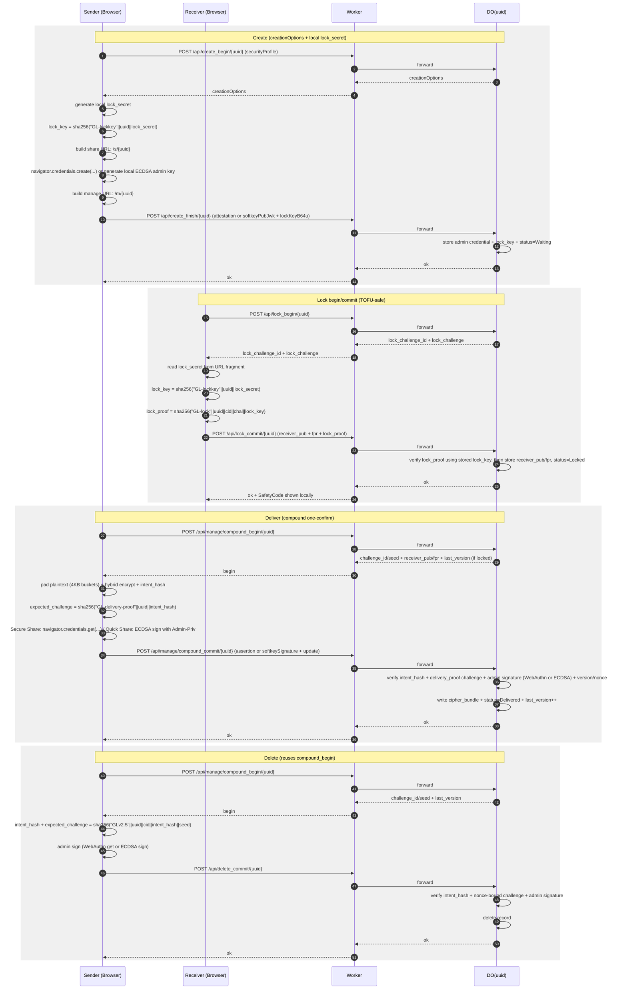

<!-- synced-with: b910249 -->

> **语言**: [English](./PRD.md) | 中文

# ZeroLink 产品需求文档 (PRD) v3.0

**Security-First / Low-Friction / DO-Atomic / WebAuthn Admin / TOFU-Safe / Padded Ciphertext**

> **v3.0 变更摘要（相对 v2.5）**：将安全模式统一为两个用户入口：**Quick Share**（密码模式）和 **Secure Share**（Passkey 模式）。

---

## 1. 产品概述

ZeroLink 是一款零知识秘密分享工具：无账号、服务器不持有明文与私钥。内容端到端加密，只有接收方本地私钥可解密。发送方拥有管理权，可更新/销毁密文，但无法解密内容。

v3.0 的产品目标：

**在不牺牲"极简使用体验"的前提下，把真实世界的高概率攻击面（抢占锁定、passkey 同步、密文长度侧信道、恶意下发 JS）降到可接受甚至可审计的级别。**

---

## 2. 安全目标与威胁模型

### 2.1 安全目标（必须满足）

1. **服务器零知识**：服务器/DO 不存明文与任何私钥
2. **端到端保密**：明文仅在接收方本地出现
3. **更新/销毁不可伪造**：仅管理者可授权写入/销毁
4. **抗重放/乱序/并发覆盖**：version 单调 + nonce 去重 + DO 串行
5. **最小元数据泄露**：公共接口不可推断状态；receiver_pub 不向未授权者暴露
6. **前端完整性可验证**：CSP/Signed Manifest/零第三方脚本/可复现构建
7. **管理权私钥不可导出**：WebAuthn 私钥驻留系统/硬件
8. **TOFU 抢占锁定风险可控**：预加载爬虫无法先于真实接收方 lock
9. **密文长度泄露显著降低**：默认 padding 到固定块边界

### 2.2 明确边界（必须写清）

- 客户端被恶意扩展/木马控制：仍可能在用户确认窗口内滥用一次操作；无法静默导出管理私钥长期控制
- Web 场景无法彻底解决"恶意服务器下发 JS"这一终极信任问题：v2.5 提供 **自托管/离线包/可验证发布链**作为可选"上限方案"

---

## 3. 核心改动概览（相对 v2.4）

### 3.1 新增：Lock Secret（URL Fragment）防抢占锁定

- create 时生成 lock_secret（32 bytes 随机），**只放在分享链接的 URL fragment**（例如 /s/UUID#k=...）
- **fragment 不会被 HTTP 请求携带**，预加载机器人即使访问 /s/UUID 也拿不到 lock_secret，因此无法 lock
- lock 需要 lock_secret 参与挑战响应（Lock Challenge）

### 3.2 新增：Padding（块对齐）降低密文长度泄露

- 明文加密前统一 padding 到 4KB/8KB（默认 4KB）倍数
- padding 结构包含：原文长度 + 随机填充
- cipher_bundle 仍为 AES-GCM 密文，但长度变成离散桶

### 3.3 收紧：接收方 KDF 强制 Argon2id

- 默认且必须：Argon2id（参数目标耗时 250–500ms）
- PBKDF2 未实现

### 3.4 两档用户入口（v3.0 简化）

创建时可选两档：
- **Quick Share**：密码模式，本地生成 ECDSA 管理密钥（Argon2id 包裹），无需 passkey，4KB padding
- **Secure Share**：Passkey 模式，UV=required / RK=discouraged，8KB padding

### 3.5 新增：Self-Hosting / Verifiable Releases

- 官方 Cloudflare 版保持默认
- 提供 Docker Compose 一键自托管（当前打包为 Caddy + Go API + PostgreSQL + MinIO，对已发布前端契约提供协议等价实现）
- 发布链：签名 Manifest + 可复现构建 + 可选离线静态包（用户可在本地打开/本域部署）

---

## 4. 产品模式与安全档位（对外清晰）

创建时可选 `securityProfile`（v3.0 两档）：

### 1. Quick Share（快速分享）

- **管理权**：本地生成 ECDSA P-256 keypair，由用户密码 Argon2id 包裹后编码在管理链接的 URL fragment 中（不存 IndexedDB）
- **WebAuthn**：不需要
- **接收方**：Argon2id 强制
- **Padding**：4KB 块
- **adminMode**：`password`（内部协议字段）
- **适合**：跨设备/跨浏览器、无 passkey 支持环境，或希望使用密码管理器的用户

### 2. Secure Share（安全分享）

- **管理权**：WebAuthn passkey（设备或平台），UV=required，RK=discouraged
- **WebAuthn**：必须，不可降级
- **接收方**：Argon2id 强制
- **Padding**：8KB 块（更高隐私）
- **adminMode**：`webauthn`（内部协议字段）
- **适合**：最高安全需求，passkey 可用的环境

---

## 5. 用户流程（v2.5 UX 版）

### 5.1 创建（Sender）

1. 选择模式：**Quick Share**（密码）或 **Secure Share**（Passkey）
2. **Quick Share 流程**：输入密码 → 本地生成 ECDSA 密钥对 → Argon2id 包裹 → Create Finish（adminMode=password）
3. **Secure Share 流程**：Create Begin → WebAuthn 注册（UV=required，RK=discouraged）→ Create Finish
4. 页面显示两条链接：
   - 分享链接（接收方）：/s/:uuid#k=\<lock_secret_b64url\>[&af=\<sender_auth_fpr\>]
   - 管理链接（发送方）：/m/:uuid#wk=\<wrapped_priv\>（Quick Share）或 /m/:uuid（Secure Share）

> **UI 强制提示**：分享链接必须完整复制（包括 # 后部分），否则接收方无法上锁

### 5.2 接收方上锁（Receiver：防呆）

- 打开分享链接后，页面展示极简动画（3 帧）：
    1. "你输入的密码短语只在你这里"
    2. "你的密码短语生成你专属的解密密钥——发送方不会知道"
    3. "上锁后，只有你能打开内容"
- 输入密码 → 生成 RSA keypair → Argon2id 包裹私钥存本地
- lock 请求必须携带 lock challenge 响应（见协议）
- 上锁成功后显示 **安全码（Safety Code）**：
    - Emoji 序列（8 个 emoji）
    - 颜色块（4×4 色块）
    - "高级"里可展开 raw hex 指纹

### 5.3 发送方投递（Sender：软化核对）

- 管理页显示相同的 Safety Code（emoji/颜色块），文案是：
    - "请快速核对对方发来的安全码是否一致（推荐通过电话/另一个聊天工具核对）"
- 默认 UI 不出现"指纹/哈希/公钥"等词；高级模式才显示
- 点击投递：走 compound_begin/commit，一次系统确认完成写入

### 5.4 WebAuthn 不可用（降级 UX）

当 navigator.credentials 不可用或调用失败：

- 页面自动检测 WebAuthn 支持状态
- **Quick Share**：始终可用（不依赖 WebAuthn），当 WebAuthn 不可用时默认选中 Quick Share
- **Secure Share**：显示"此环境不支持 Passkey"警告，按钮置灰不可点击
- UI 显示提示："Secure Share 需要 WebAuthn 支持，请换浏览器/设备，或使用 Quick Share"

---

## 6. 关键安全问题的 v2.5 解决方案

### 6.1 TOFU 抢占锁定（预加载爬虫先 lock）

**v2.5 的硬修复：Lock Secret + Lock Challenge**

- 攻击者/爬虫即使先访问 /s/:uuid，也无法 lock，因为它没有 fragment 中的 lock_secret
- lock 时 DO 下发一次性 challenge，接收方需提供 lock_proof = SHA256("GL-lock"||uuid||lock_challenge_id||lock_challenge||lock_key)
- DO 验证 lock_proof 后才接受 receiver_pub

同时 UX 层仍建议：

- 安全码核对建议走带外通道（电话/另一个 IM），但不再是唯一防线

### 6.2 密文长度泄露

**v2.5 默认 padding**：明文在加密前被填充到固定块倍数，降低长度推断精度。

### 6.3 Passkey 同步边界（v3.0 简化）

- **Quick Share**：不使用 WebAuthn，无 passkey 同步问题
- **Secure Share**：使用 WebAuthn（UV=required, RK=discouraged），允许平台同步 passkey；如浏览器提供 backupState/backupEligibility，可检测并提示，但不强制拒绝

### 6.4 恶意服务器下发 JS

v2.5 给出三层应对：

1. **可验证发布链（Signed Manifest + 可复现构建）**：提升"被篡改可被发现"的概率
2. **离线包/本地打开**（计划中，尚未实现）：用户可选择从发布页下载离线静态包（减少在线下发风险）
3. **自托管**（当前）：Docker Compose 打包已提供协议等价实现，彻底把信任根交给用户

---

## 7. 密码学与数据格式（v2.5）

### 7.1 内容加密（不变 + padding）

- AES-256-GCM 加密正文（密文包仍是 cipher_bundle）
- RSA-OAEP-256 封装 AES key（enc_content_key）

#### Padding 方案（强制，默认开启）

定义 padded_plaintext 格式：

- len：uint32（原文长度，big-endian）
- data：原文 bytes
- pad：随机 bytes，填充到 ceil((4 + len)/PAD_BLOCK)*PAD_BLOCK
- 默认 PAD_BLOCK = 4096（可配置 8192）

最终加密 padded_plaintext，接收方解密后按 len 截取原文。

> 对超大内容（例如 >1MB）可允许关闭 padding 或采用更大块（例如 64KB），但默认仍启用。

### 7.2 Receiver 私钥包裹（强制 Argon2id）

- Argon2id 参数采用目标耗时策略（250–500ms）
- 参数写入本地包头：salt, m, t, p, version
- PBKDF2 未实现

### 7.3 Safety Code（软化指纹核对）

从 receiver_pub_fpr = SHA256(SPKI(receiver_pub)) 计算：

- Emoji Safety Code：取每个 hash byte 的低 nibble（4 bits）映射到 16 项 emoji 调色板（固定表，稳定输出）
- Color Blocks：取 hash nibble 映射到固定调色板
显示规则：

- 默认展示 Emoji 或 Color（可切换）
- Advanced 展示：短指纹（前 6/后 6）+ 完整 hex（折叠）

---

## 8. 状态机（与 v2.4 类似，新增 lock challenge）

状态与转移保持 v2.4，但 lock 需要 lock_begin/lock_commit 的挑战流程（见 API）。

**状态集合**：Waiting, Locked, Delivered, Deleted, Expired

**允许转移**：
- Waiting -> Locked（lock_commit 成功）
- Locked -> Delivered（compound_commit update）
- Delivered -> Delivered（compound_commit update）
- Waiting|Locked|Delivered -> Deleted（delete_commit）
- Waiting|Locked|Delivered -> Expired（expire）

**禁止转移**：
- 非 Waiting 状态重复 lock_commit
- Deleted/Expired 后任何写操作
- 未通过 lock_begin 的 lock_commit（challenge 必须匹配且一次性）

---

## 9. Quick Share（密码模式）协议定义

Quick Share 是 v3.0 中替代"兼容模式（Compatibility Mode）"的正式用户入口，不再是降级选项：

- **管理权**：本地生成 ECDSA P-256 私钥（Admin-Priv），用用户密码 Argon2id 包裹后编码在管理链接的 URL fragment 中（不存 IndexedDB）
- **更新/删除授权**：ECDSA 签名 payload 模式（DO 仍负责 version/nonce 原子性）
- **协议字段**：`adminMode: "password"`（内部）
- **Padding**：4KB 块（相比 Secure Share 的 8KB，降低流量但稍低隐私）
- **UI**：不标注"较低安全"，而是作为独立的有效分享模式展示

> 注意：Quick Share 安全性取决于用户密码强度。UI 通过密码强度指示器引导用户选择足够强度的密码。

---

## 10. API（v3.0 当前）

通用要求：

- 所有响应：`Cache-Control: no-store`
- `/api/public/:uuid` 返回公开状态快照，而不是仅 `exists`
- 所有敏感写操作走 DO 串行
- 错误响应恒定形状 `{ok:false, code}`

### 10.1 GET /api/public/:uuid

Response：
```json
{
  "ok": true,
  "state": "waiting|locked|delivered",
  "adminMode": "webauthn|password",
  "securityProfile": "quick|secure",
  "receiverPubFpr": "hex..."
}
```

说明：

- `receiverPubFpr` 仅在接收方已上锁后返回
- 频道被物理删除或过期后，公共读取返回 `404 NOT_FOUND`
### 10.2 创建（Quick Share / Secure Share）

#### POST /api/create_begin/:uuid

Request：
```json
{
  "uuid": "string(21)",
  "timestamp": 1730000000000,
  "securityProfile": "quick|secure"
}
```

Response：
```json
{
  "ok": true,
  "creationOptions": { "...": "..." }
}
```

服务端行为：

- 创建 `waiting` 频道记录并持久化 `securityProfile`
- 为 Secure Share 签发 WebAuthn 注册 challenge（封装在 `creationOptions` 中）
- Quick Share 仍走同一个 `create_begin`/`create_finish` 协议，但前端不会使用返回的 WebAuthn `creationOptions`
- `lock_secret` 由前端本地生成并拼接到分享链接 fragment；服务端只在 `create_finish` 后持久化 `lockKeyB64u`

#### POST /api/create_finish/:uuid

WebAuthn 管理模式：
```json
{
  "adminMode": "webauthn",
  "uuid": "string(21)",
  "attestation": { "...": "..." },
  "lockKeyB64u": "base64url(sha256('GL-lockkey'||uuid||lock_secret))",
  "timestamp": 1730000000000
}
```

Quick Share password 模式：
```json
{
  "adminMode": "password",
  "uuid": "string(21)",
  "softkeyPubJwk": { "...": "..." },
  "lockKeyB64u": "base64url(sha256('GL-lockkey'||uuid||lock_secret))",
  "timestamp": 1730000000000
}
```

说明：

- 服务端保存管理凭据、`securityProfile` 和 `lockKeyB64u`
- `lockKeyB64u` 用于后续验证 `lock_proof`，服务端从不持久化 `lock_secret`

### 10.3 上锁（拆成 lock_begin / lock_commit）

#### POST /api/lock_begin/:uuid

目的：避免 lock_proof 被重放，且让 DO 控制一次性消费。

Response：
```json
{
  "ok": true,
  "uuid": "string",
  "lock_challenge_id": "base64url",
  "lock_challenge": "base64url(32)",
  "expires_at": 1730000000000
}
```

DO 存 challenge（TTL 60s，一次性）。

#### POST /api/lock_commit/:uuid

Request（接收方携带 receiver_pub + lock_proof）：

```json
{
  "uuid": "string(21)",
  "lock_challenge_id": "base64url",
  "lock_proof": "hex(sha256(...))",
  "receiver_pub_jwk": { "...": "..." },
  "receiver_pub_fpr": "hex...",
  "locked_at": 1730000000000
}
```

其中：

- lock_proof = SHA256("GL-lock" || uuid || lock_challenge_id || lock_challenge || lock_key)
- lock_key 由前端从 lock_secret 派生（不上传 lock_secret）

DO 校验：

- lock_challenge 未过期未消费
- lock_key 与 lock_proof 对应正确（DO 用存的 lock_key 验证）

最终：写入 receiver_pub、fpr、status=Locked

### 10.4 投递（compound_begin/commit，v3.0 保持一次确认）

与 v2.4 相同，但 update payload 增加：

- pad_block（默认 4096）

> 注意：`plaintext_len` 不是 API 层字段。它仅存在于加密后的 padding header 内部（`padded_plaintext` 的前 4 字节；参见附录 E），不作为请求的顶层字段传输。

### 10.5 删除（compound_begin + delete_commit）

删除复用 `compound_begin` 获取 challenge，再调用 `delete_commit` 完成管理授权。没有单独的 `delete_begin` 端点。

### 10.6 Quick Share Password API

新增字段：

- adminMode="webauthn"|"password"
- password 模式下 update/delete 需要 sig（ECDSA 签名）

---

## 11. WebAuthn 验证（v3.0，继承 v2.4 字节级规范）

- origin、rpIdHash、UV/UP、challenge 精确匹配、COSE ES256 验签
- Secure Share：
    - userVerification="required"
    - residentKey="discouraged"
    - attestation="none"

---

## 12. 前端完整性与"可验证发布链"（解决恶意下发 JS 的上限方案）

### 12.1 Signed Manifest（推荐）

- 发布时生成 manifest.json，包含：
    - 版本号
    - 每个静态资源的 SHA-256
    - 构建时间、commit hash
- 用项目的 **离线签名私钥（Ed25519）** 对 manifest 签名，发布 manifest.sig
- App 在运行时展示 manifest hash（高级用户可核对）

> 注意：这无法阻止攻击者直接篡改 index.html 关闭校验，但能让"离线下载包 + 校验工具"变得可行。

### 12.2 离线包（Paranoid Mode）（计划中，尚未实现）

- 提供单独下载的 offline.zip（静态文件）
- 用户可本地打开或本域自托管（甚至 file://，但 WebAuthn 与某些 API 可能受限，建议本域托管）

### 12.3 自托管（Self-Hosting）（计划中，尚未实现）

- 提供 Docker Compose：
    - 前端静态文件
    - API 服务（协议等价实现：挑战/nonce/version/lockkey/padding/webauthn 验证）
    - DB（Postgres/MySQL）或 SQLite + 事务锁
- 自托管版必须通过同样的协议测试向量（canonical、challenge、nonce）

---

## 13. UI/UX 规范（落实产品经理建议）

### 13.1 指纹核对的柔化呈现

- 默认：Emoji Safety Code（例如 8 个 emoji）
- 次选：Color Blocks（例如 4×4）
- Advanced：短指纹 + 完整 hex（折叠）

文案原则：

- 不出现"指纹/哈希/公钥"术语（高级模式除外）
- 强烈建议"带外核对"，但不制造焦虑（用轻提示）

### 13.2 接收方防呆动画与文案

- 3 帧以内动画 + 1 句强提示：
    - "你的密码短语生成了你的解密密钥——发送方不会知道"
- 密码强度提示（但不强迫过强，避免劝退；Secure Share 作为更高安全选项单独提供）

### 13.3 WebAuthn 不可用时的引导

- 失败时给出明确原因分类（不泄露敏感信息）：
    - "浏览器不支持"
    - "当前页面不安全（非 https / 非同源）"
    - "系统未启用生物识别/安全密钥"
- Quick Share：保持可用，并说明这是密码模式
- Secure Share：阻断并给"换设备/换浏览器"建议

---

## 14. 测试向量与验收（v3.0）

必须新增测试：

1. **TOFU 抢占锁定**：没有 fragment 的访问无法完成 lock_commit（lock_proof 验证失败）
2. **lock_challenge 重放**：同 challenge_id 再次 lock_commit 必失败
3. **padding**：不同长度明文映射到相同桶长度密文（至少 4KB 桶）
4. **Argon2id 强制**：接收方私钥包裹必须为 Argon2id；Quick Share 管理密钥也必须使用 Argon2id 包裹
5. **Secure Share Policy**：secure 必须要求 UV=required，且注册使用 non-discoverable credential（`residentKey="discouraged"`）

---

## 15. 协议图（Mermaid）



---

## 附录 A：参数表与常量（强制）

- UUID_LENGTH = 21（nanoid）
- TIMESTAMP_SKEW_MS = 120000（±120s）
- NONCE_BYTES = 24（base64url）
- NONCE_TTL_MS = 600000（10min）
- CHALLENGE_BYTES = 32
- CHALLENGE_TTL_MS = 60000（60s）
- LOCK_SECRET_BYTES = 32（base64url，存在 URL fragment）
- LOCK_KEY_BYTES = 32（server 存储，sha256 输出）
- PAD_BLOCK_DEFAULT = 4096（可配置 8192）
- PAD_BLOCK_MAX = 65536（上限）
- MAX_PLAINTEXT_BYTES = 2MB（inline 明文上限；更大的文件在支持时切 multipart）
- WebAuthn：默认 alg = -7 (ES256)、UV required（Strict/HardwareOnly）

---

## 附录 B：Canonical（Ghost Canon v1）规范与测试向量（强制）

### B1. 规则

- object key 递归按 Unicode code point 升序
- array 保持顺序
- number 必须整数、十进制、无科学计数
- 输出 minified JSON，无空格
- UTF-8 bytes

### B2. 测试向量（update / delete）

#### B2.1 update（无 sig）

输入对象（概念）：

```json
{
  "op": "update",
  "uuid": "u",
  "version": 1,
  "timestamp": 1730000000000,
  "nonce": "n",
  "receiver_pub_fpr": "f",
  "cipher_bundle": {
    "ciphertext": "ct",
    "iv": "iv",
    "aad": "aad",
    "enc_content_key": "ek",
    "ciphertext_hash": "h"
  },
  "expire_at": null,
  "pad_block": 4096
}
```

canonical 输出必须为：

```json
{"cipher_bundle":{"aad":"aad","ciphertext":"ct","ciphertext_hash":"h","enc_content_key":"ek","iv":"iv"},"expire_at":null,"nonce":"n","op":"update","pad_block":4096,"receiver_pub_fpr":"f","timestamp":1730000000000,"uuid":"u","version":1}
```

#### B2.2 delete

输入对象（概念）：

```json
{
  "op": "delete",
  "uuid": "u",
  "version": 2,
  "timestamp": 1730000000000,
  "nonce": "n"
}
```

canonical 输出必须为：

```json
{"nonce":"n","op":"delete","timestamp":1730000000000,"uuid":"u","version":2}
```

---

## 附录 C：TOFU 抢占锁定修复（Lock Secret / Lock Key / Lock Proof）精确定义

### C1. Create 时生成与存储（关键）

- 前端本地生成 lock_secret：随机 32 bytes，并写入分享链接 fragment：
    ```
    share_url = /s/<uuid>#k=<b64url(lock_secret)>
    ```
- 前端计算 lock_key：
    ```
    lock_key = SHA256( UTF8("GL-lockkey") || UTF8(uuid) || lock_secret )
    ```
- 前端在 create_finish 时回传 lock_key_b64u
- 服务端存储 lock_key（base64url 或 hex，必须固定一种；推荐 base64url）

> 注意：lock_secret 永不入日志、永不以明文存储。

### C2. Lock 两阶段流程

1. lock_begin：DO 签发 {lock_challenge_id, lock_challenge}（随机 32 bytes，TTL 60s，一次性）
2. lock_commit：客户端提交 receiver_pub + fpr + lock_proof

### C3. lock_proof 计算（客户端）

- 客户端从 fragment 拿到 lock_secret，本地算 lock_key（同 C1）
- 再算：
    ```
    lock_proof = SHA256( UTF8("GL-lock") || UTF8(uuid) || b64url_decode(lock_challenge_id) || b64url_decode(lock_challenge) || lock_key )
    ```
- lock_commit 只提交 lock_proof（hex 或 base64url；推荐 hex 小写）

### C4. DO 验证（服务端）

- 从 DO 存储取 lock_key
- 用相同拼接重算 expected lock_proof
- 一致才允许写入 receiver_pub

### C5. 安全性质

- 预加载爬虫没有 fragment → 得不到 lock_secret → 得不到 lock_key → 无法造 lock_proof
- 即使拿到 lock_proof，也只能配合一次性 lock_challenge 使用，重放失败（challenge consumed）

---

## 附录 D：Lock API Schema（v2.5）

### D1. POST /api/lock_begin/:uuid

Response：

```json
{
  "ok": true,
  "uuid": "string(21)",
  "lock_challenge_id": "base64url(16-32)",
  "lock_challenge": "base64url(32)",
  "expires_at": 1730000000000
}
```

### D2. POST /api/lock_commit/:uuid

Request：

```json
{
  "uuid": "string(21)",
  "lock_challenge_id": "base64url",
  "lock_proof": "hex(lowercase)",
  "receiver_pub_jwk": {
    "kty": "RSA",
    "alg": "RSA-OAEP-256",
    "n": "...",
    "e": "...",
    "ext": true,
    "key_ops": ["encrypt"]
  },
  "receiver_pub_fpr": "hex(lowercase)",
  "locked_at": 1730000000000
}
```

Response：

```json
{
  "ok": true
}
```

错误语义（粗粒度）：

- 401：challenge 过期/不存在
- 403：lock_proof 不匹配 / 已非 Waiting
- 409：challenge 已消费（重放）

---

## 附录 E：Padding 规范（精确字节格式 + 注意事项）

### E1. padded_plaintext 格式（bytes）

- orig_len: uint32 big-endian（4 bytes）
- orig_data: orig_len bytes
- pad_rand: 随机 bytes，长度使总长成为 PAD_BLOCK 的倍数
- 总长度：ceil((4+orig_len)/PAD_BLOCK) * PAD_BLOCK

### E2. 生成规则（客户端）

- PAD_BLOCK 默认 4096，可在 update payload 中带 pad_block（用于审计一致性；不建议公开展示）
- pad_rand 必须为加密安全随机数
- 若 orig_len 仍在 inline 上限内，则继续走 legacy inline 路径；否则在部署声明支持时切到 multipart 文件模式，不支持时按 MAX_PLAINTEXT_BYTES 拒绝

### E3. 解码规则（接收方）

- 解密得到 padded_plaintext
- 读取前 4 bytes 得到 orig_len
- 截取后续 orig_len bytes 作为明文
- 忽略剩余 pad_rand

### E4. 与 AES-GCM 的关系

- 仍然使用 AES-GCM；padding 不引入 padding oracle
- AAD 继续绑定 uuid/version/fpr，防替换与上下文混淆

---

## 附录 F：Cipher Bundle 结构与长度泄露桶（bucket）策略

CipherBundle（base64url）：

- enc_content_key（RSA-OAEP 输出，长度固定约 256 bytes）
- ciphertext（长度≈padded_plaintext_len + GCM tag）
- iv（12 bytes）
- aad（建议 base64url 的 AAD bytes）
- ciphertext_hash（SHA-256 hex）

桶策略：

- 默认 PAD_BLOCK=4096，泄露粒度为 4KB 桶
- 高安全档位可提高到 8KB/16KB（更隐私但更浪费流量）

---

## 附录 G：WebAuthn Policy（v3.0）规范

### G1. Quick Share（quick）

- 不使用 WebAuthn，完全密码模式
- adminMode = "password"

### G2. Secure Share（secure）

- userVerification = "required"（强制）
- residentKey = "discouraged"（使用 non-discoverable credential）
- attestation = "none"
- 适合平台 passkey 和硬件密钥

---

## 附录 H：WebAuthn 验证字节级步骤（延续 v2.4，补充对 lock/profile 的约束点）

commit（compound/delete）校验顺序必须包含：

1. 校验 credentialId == stored cred_id
2. clientDataJSON：
    - type=="webauthn.get"
    - origin strict match
    - challenge strict match expected_challenge
3. authenticatorData：
    - rpIdHash == SHA256(rpId)
    - flags：UP=1；UV 按 policy
4. 验签：
    - signedData = authenticatorData || SHA256(clientDataJSON)
    - COSE ES256 → P-256 公钥
5. signCount 策略：记录异常不强阻断（避免误伤同步）

---

## 附录 I：Quick Share（password/softkey）协议规范

Quick Share 在 v3.0 中是正式用户入口（不再是降级模式）。

### I1. 管理密钥生成

- 前端生成 ECDSA P-256 keypair
- Admin-Priv 用 Argon2id 包裹后编码在管理链接的 URL fragment 中（不存 IndexedDB；密码由用户提供）
- 服务器存 Admin-Pub（JWK）+ adminMode="password"
### I2. 写入授权

- update/delete 请求基于 ECDSA sig（Ghost Canon v1 canonical payload）
- DO 仍负责 version/nonce/challenge 串行一致性

### I3. UI 标注

- 显示"Quick Share (Password)"徽章（而非"兼容模式"）
- 不强制二次确认风险（密码强度指示器引导用户）
- 密码强度较低时，UI 给出建议但不强制阻断

---

## 附录 J：错误码、响应恒定形状与抗枚举策略

响应体统一：

```json
{
  "ok": false
}
```

建议状态码：

- 400：格式错误
- 401：timestamp 窗口失败 / challenge 过期（统一）
- 403：权限/状态不允许 / WebAuthn 失败 / lock_proof 失败（统一）
- 404：uuid 不存在（可将 Deleted/Expired 也返回 404，进一步降泄露）
- 409：nonce 重放 / version 冲突 / challenge 已消费（统一）

公共接口 /api/public/:uuid：

- 返回当前 `state`、`adminMode`、`securityProfile` 和可选 `receiverPubFpr`
- 物理删除或过期后返回 `404 NOT_FOUND`

---

## 附录 K：安全码（Safety Code）视觉化规范（emoji / color）

### K1. 输入

- receiver_pub_fpr（32 bytes sha256）

### K2. Emoji 方案（推荐默认）

- 取 fpr bytes 分成 8 组，每组取低 nibble（4 bits）→ 映射到 16 项 emoji 调色板（固定表）
- 输出 8 个 emoji，跨端稳定一致
- UI 展示为：🐳 🍀 🧩 ...（例子）

### K3. Color Blocks

- 取 fpr 的 32 bytes → 每个 nibble 映射到 16 色固定调色板
- 输出 4×4 色块（固定布局），跨端稳定

### K4. Advanced 展示

- 短指纹：前 6 bytes + 后 6 bytes（hex）
- 完整 hex 折叠显示（用户主动展开）

---

## 关键实现注意事项

### 前端必须配合的两个关键点（否则 v2.5 语义会破）

1. **create_finish 必须回传 lock_key_b64u**
    - 因为 server 不能也不应该拿到 lock_secret
    - 正确流程：前端拿到 lock_secret → 本地算 lock_key → create_finish 把 lock_key_b64u 传给后端存起来
    - 这样后端能验证 lock_proof，但永远还原不了 lock_secret

2. **lock_commit 只传 lock_proof，不传 lock_secret**
    - lock_secret 只存在 fragment，只用于本地派生 lock_key
    - lock_proof = sha256("GL-lock" || uuid || cid || chal || lock_key)
    - 服务器用存储的 lock_key 验证

### 最容易"实现跑偏"的两点（验收口径）

1. **lock_key/lock_proof**：server 必须能验证，且 lock_secret 不得上传/入库
2. **padding**：必须在加密前完成，且解密后严格按 orig_len 截取
